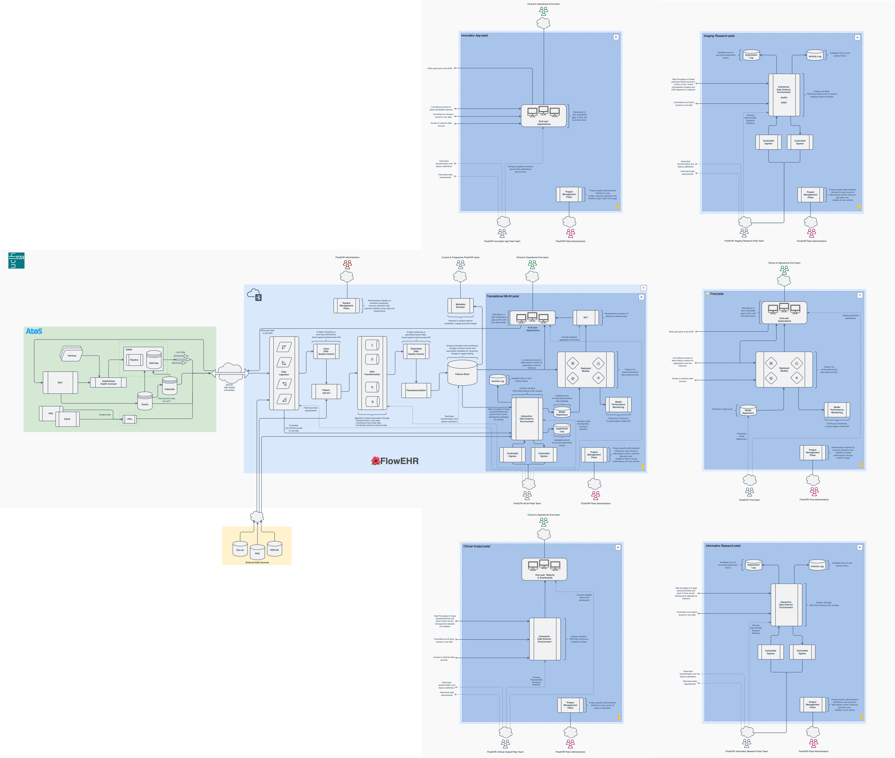

FlowEHR 🌺 is a safe, secure & cloud-native development & deployment platform for digital healthcare research & innovation.

We designed this to
- Enable iterative, robust & sustainable development & deployment of digital interventions at UCLH by enabling our multi-disciplinary teams to work higher up the stack
- Add momentum to the Trust's digital transformation journey
- Establish UCLH/UCL as the premier partner for academia, the HealthTech sector and the UCLP Academic Health Sciences Network
- Cross the Machine Learning for Healthcare (ML4H) chasm

and to ultimately provide direct benefit to patient outcomes and the health system.

It should be considered as an evolution of the original vision for EMAP as UCLH's [_Experimental Medicine Applications Platform_](./emap.md).

Our primary and original use case is the safe & effective development & deployment of real-time translational Machine Learning interventions in clinical and operational settings inside the hospital.

FlowEHR is pronounced like _flower_.

## High-level Solution Overview

## Documentation

A working draft of the documentation is available [here](https://safehr-data.github.io/Garden-Path/)
